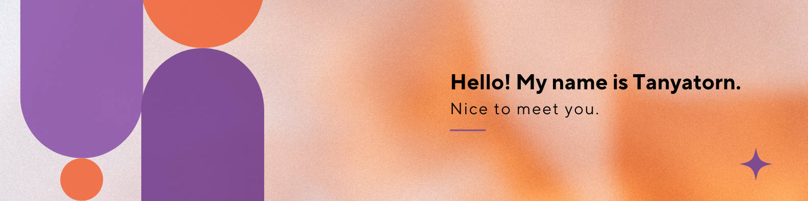

I am a dedicated and passionate Computer Engineering student in my fourth year at Sripatum University,
 seeking an internship as a Front-end Developer. My strong interest lies in website and application technology, 
 with a particular focus on Front-end Development and UX/UI Design. I am always eager about learning new technologies.
  Thanks for dropping by, hope you find some of my work interesting.

## 💻 Tech Stack
**Programming Languages & Framework**
 

 
 
 
 
 
 
 
 
 
**Tools & Program**
 
 
 
 

 
 

## 🎯 GitHub Stats

## 🌐 Socials
   

---
<!-- Proudly created with GPRM ( https://gprm.itsvg.in ) -->
